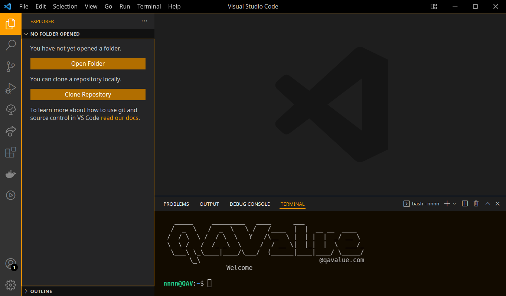

# QAV Color Theme

 

This is a theme built mainly for QAV Developers ([qavalue.com](https://www.qavalue.com)), but it can be used by any developer. Feel free to try it out!

## Installation
Preferences:

1. Go to `Extensions` (**File > Preferences > Extemsions**).
2. Search for `QAValue Color Theme` and install it.
3. Go to `Color Themes` (**File > Preferences > File Theme**) and choose `QAValue Color Theme` as the color theme.

## License

The source code is licensed under the [MIT](https://github.com/qavalue/qav-color-theme/blob/master/LICENSE.md) license.

## Versioning

`qav-color-theme` follows [Semantic Versioning 2.0.0](http://semver.org/).

## Change Log

You can checkout all our changes in our [change log](https://github.com/qavalue/qav-color-theme/blob/master/CHANGELOG.md).
